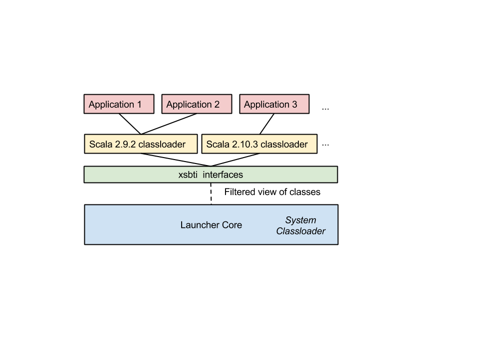

Sbt Launcher Architecture
=========================

The sbt launcher is a mechanism whereby modules can be loaded from ivy
and executed within a jvm. It abstracts the mechanism of grabbing and
caching jars, allowing users to focus on what application they want and
control its versions.

The launcher's primary goal is to take configuration for applications,
mostly just ivy coordinates and a main class, and start the application.
The launcher resolves the ivy module, caches the required runtime jars
and starts the application.

The sbt launcher provides the application with the means to load a
different application when it completes, exit normally, or load
additional applications from inside another.

The sbt launcher provides these core functions:

-   Module Resolution
-   Classloader Caching and Isolation
-   File Locking
-   Service Discovery and Isolation

Module Resolution
-----------------

The primary purpose of the sbt launcher is to resolve applications and
run them. This is done through the `[app]` configuration section. See
:doc:Configuration for more information on how to configure module
resolution.

Module resolution is performed using the Ivy dependency managemnet
library. This library supports loading artifacts from Maven repositories
as well.

Classloader Caching and Isolation
---------------------------------

The sbt launcher's classloading structure is different than just
starting an application in the standard java mechanism. Every
application loaded by by the launcher is given its own classloader. This
classloader is a child of the Scala classloader used by the application.
The Scala classloader can see all of the `xsbti.*` classes from the
launcher itself.

Here's an example classloader layout from an sbt launched application.

In this diagram, three different applications were loaded. Two of these
use the same version of Scala (2.9.2). In this case, sbt can share the
same classloader for these applications. This has the benefit that any
JIT optimisations performed on scala classes can be re-used between
applications thanks to the shared classloader.

Caching
-------

The sbt launcher creates a secondary cache on top of Ivy's own cache.
This helps isolate applications from errors resulting from unstable
revisions, like `-SNAPSHOT`. For any launched application, the launcher
creates a directory to store all its jars. Here's an example layout.

Locking
-------

In addition to providing a secondary cache, the launcher also provides a
mechanism of safely doing file-based locks. This is used in two places
directly by the launcher:

1.  Locking the boot directory.
2.  Ensuring located servers have at most one active process.

This feature requires a filesystem which supports locking. It is exposed
via the `xsbti.GlobalLock` interface.

*Note: This is both a thread and file lock. Not only are we limiting
access to a single process, but also a single thread within that
process.*

Service Discovery and Isolation
-------------------------------

The launcher also provides a mechanism to ensure that only one instance
of a server is running, while dynamically starting it when a client
requests. This is done through the `--locate` flag on the launcher. When
the launcher is started with the `--locate` flag it will do the
following:

1.  Lock on the configured server lock file.
2.  Read the server properties to find the URI of the previous server.
3.  If the port is still listening to connection requests, print this
    URI on the command line.
4.  If the port is not listening, start a new server and write the URI
    on the command line.
5.  Release all locks and shutdown.

The configured `server.lock` file is thus used to prevent multiple
servers from running. Sbt itself uses this to prevent more than one
server running on any given project directory by configuring
`server.lock` to be `\${user.dir}/.sbtserver`.
